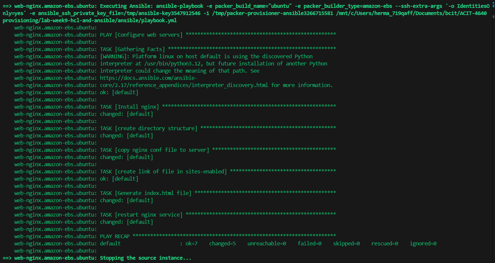
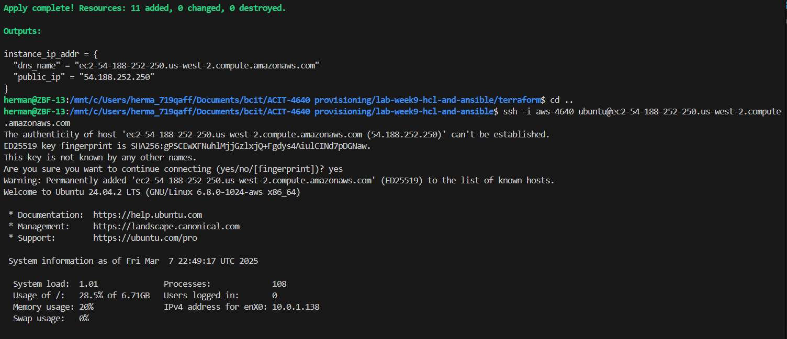
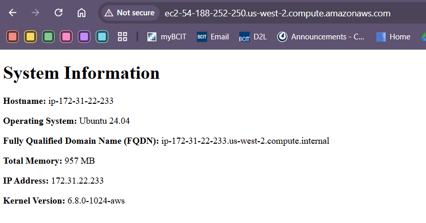

# lab-week9-hcl-and-ansible

This lab we are using Ansible, Terraform, and Packer all together to deploy a web app

# Instructions
Instructions for this lab are similar to lab6 and lab4, so some were adapted from them

## SSH key generation
1. Create a new ssh key with `ssh-keygen` called **aws-4640** to import to AWS via `./scripts/import_lab_key aws-4640.pub` 

## Packer setup and build
1. In your **packer** directory, use `packer init .` to initialize your project
1. Use `packer fmt .` to format your template
1. Use `packer validate .` to validate your template syntax
1. Use `packer build .` to create your resources

## Terraform setup and deployment
1. In your **terraform** directory, use `terraform init` to initialize your project
1. Use `terraform fmt` to format your code
1. Use `terraform validate` to validate your syntax 
1. Use `terraform plan` to verify your changes
1. Use `terraform apply` to create your resources

## Clean up
1. In your **terraform** directory, use `terraform destroy` to take down your resources
1. In the **AWS console**, deregister the AMI and delete the snapshots to clean up
1. In your **scripts** directory, use `./delete_lab_key` to clean up your ssh key from your AWS account 

## Screenshots
1. packer build .

1. SSH into instance

1. Open in browser
